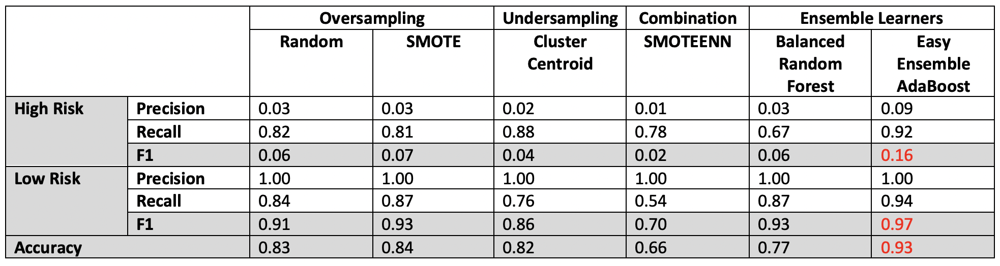

# Machine Learning Models To Predict Credit Risk

## Overview
The purpose of this project was to assess the performance of different supervised machine learning models on predicting credit risk. The [dataset](data/LoanStats_2019Q1.csv.zip) was from LendingClub, a lending services company. The target variable, credit risk ("loan status"), was split into "high-risk" vs. "low-risk". Models assessed were sampling algorithms combined with logistic regression, and ensemble learners. 

Sampling algorithms were:

#### Oversampling
- Naive Random
- Synthetic Minority Oversampling Technique (SMOTE)

#### Undersampling
- Cluster Centroid

#### Combination of Over- and Undersampling
- Synthetic Minority Oversampling Technique and Edited Nearest Neighbors (SMOTENN)

Ensemble learners were:
- Balanced Random Forest Classifier
- Easy Ensemble AdaBoost Classifier
    - combination of random undersampling with adaptive boosting

## Results & Analysis
See Table 1 for a summary of results, which included precision, recall (sensitivity), F1 scores and accuracy for each model. See [credit_risk_resampling.ipynb](analysis/credit_risk_resampling.ipynb) and [credit_risk_ensemble.ipynb](analysis/credit_risk_ensemble.ipynb) for the data analysis.

#### Table 1. Performance Parameters of Supervised Machine Learning Models for Predicting Credit Risk

All models were poor at predicting high credit risk (F1 score range: 0.02 to 0.16). This was mainly due to low precision (0.01 to 0.09), indicating high false-positive rates (i.e. many cases were incorrectly predicted to be high credit risk). Conversely, models had moderate to high recall (0.67 to 0.92). This means that there were moderately-low false-negative rates (i.e. a low number of high risk cases were missed). 

All models were moderately-good to excellent at predicting low credit risk (F1 score range: 0.70 to 0.97). This was mainly due to high precision (1.00 for all models), indicating practically no false-negatives (i.e. all cases predicted to be low risk were actually low risk). Recall was variable (0.54 to 0.94), indicating variable false-positive rates. In other words, some models were better than others at detecting low credit risk cases e.g. Easy Ensemble vs. SMOTEENN, respectively. 

Models had variable accuracy, from SMOTEENN with 66% to Easy Ensemble with 93%. This means that there was a range of ability for models to predict both high and low credit risk. 

For the Balanced Random Forest Classifier, the top 3 contributing feature variables were (in descending order):

(1) "principal received to date" ("total_rec_prncp")
(2) "last total payment amount received" ("last_pymnt_amnt")
(3) "payments received to date for portion of total amount funded by investors" ("total_pymnt_inv")

Please refer to [credit_risk_ensemble.ipynb](analysis/credit_risk_ensemble.ipynb) for details and [LCDataDictionary.xlsx](data/LCDataDictionary.xlsx) for disambiguation of abbreviations.

Overall, Easy Ensemble AdaBoost was the best model for predicting low and high credit risk, since it showed the highest F1 scores (high risk: 0.16; low risk: 0.97) and the highest accuracy to predict both (93%). SMOTENN was the worst model with the lowest F1 scores and accuracy. However, a limitation was that data was not scaled in the preprocessing steps for SMOTENN, which partly accounts for its worse performance relative to other models. 

## Conclusion
All of the models are poor predictors of high credit risk. (The highest F1 score for high credit risk was only 0.16). Since lending companies are interested in detecting high credit risk, rather than low credit risk, none of the models are recommended. If the best model, Easy Ensemble, was used, its high recall and low precision would mean that many cases would be incorrectly predicted to be high credit risk and would require additional investigation. This would mean devoting extra resources (time, personnel, and money) to further investigation. A cost:benefit analysis could be performed and if further investigation is not prohibitively time-consuming or costly, then the model could be used as an initial screening test for potential clients. Nonetheless, trialing other models or further optimization of current models (e.g. by adding more data or other feature variables) is recommended. 

## Resources
### Data & Analysis Files
- [LoanStats_2019Q1.csv](data/LoanStats_2019Q1.csv.zip) (dataset from LendingClub)
- [LCDataDictionary.xlsx](data/LCDataDictionary.xlsx)
- [credit_risk_resampling.ipynb](analysis/credit_risk_resampling.ipynb)
- [credit_risk_ensemble.ipynb](analysis/credit_risk_ensemble.ipynb)

### Software
Python 3.8.2, Jupyter Notebook 6.0.3, numpy 1.19.1, pandas 1.0.5, scikit-learn 0.23.2, and imblearn 0.7.0